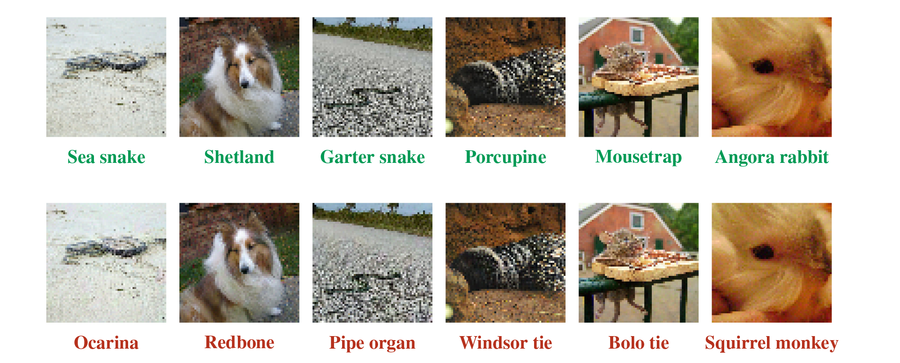

# Evaluating and Understanding the Robustness of Adversarial Logit Pairing

The code in this repository, forked from the [official
implementation](https://github.com/tensorflow/models/tree/master/research/adversarial_logit_pairing),
evaluates the robustness of [Adversarial Logit
Pairing](https://arxiv.org/abs/1803.06373), a proposed defense against
adversarial examples.

On the ImageNet 64x64 dataset, with an L-infinity perturbation of 16/255 (the
threat model considered in the original paper), we can make the classifier
accuracy 0.1% and generate targeted adversarial examples (with randomly chosen
target labels) with 98.6% success rate using the provided code and models.

See our writeup [here](https://arxiv.org/abs/1807.10272) for our analysis, including visualizations of the loss landscape induced by Adversarial Logit Pairing.

## Pictures

Obligatory pictures of adversarial examples (with randomly chosen target
classes).



## Setup

Download and untar the [ALP-trained
ResNet-v2-50](http://download.tensorflow.org/models/adversarial_logit_pairing/imagenet64_alp025_2018_06_26.ckpt.tar.gz)
model into the root of the repository.

## [RobustML](https://github.com/robust-ml/robustml) evaluation

Run with:

```
python robustml_eval.py --imagenet-path <path>
```
